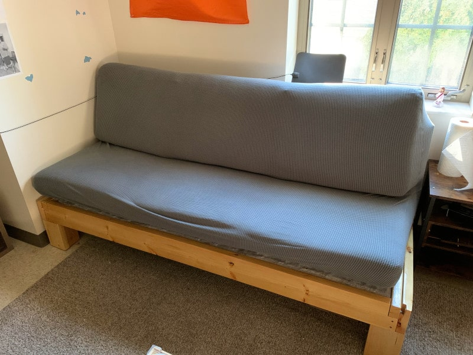

My couch is one of my favorite projects. I built it almost completely from
scratch. I'm not sure if that has ever been done before, but when I was
researching during the design phase I couldn't find much information about couch
construction.

If anyone else finds this, let it be known that there are a lot of things I
would do differently in v2. **_see the end of this post for more on that_**

Let's get into it. I tried to take pictures during the build process,
but it has been over a year now so there might be some gaps. I'll do my best to
detail the steps.

## The problem

I am (as of 2021) in college, and I am required by Notre Dame to live in a dorm
for 3 years. Dorms are small. Couches are big. Inevitably, one of those two things has
to give. In my experience, it is usually the couch size. Dorm futons/couches are
tiny, fragile, and uncomfortable. After having one of said tiny/fragile/uncomfortable
couches during my freshman year, I decided to make a
change for my next year.

Anyone who knows me knows that I don't back down from a good challenge, and let me
tell you: finding a couch that is small and light enough to move into a dorm, strong
enough to withstand the shenanigans in dorms, and comfortable enough to be worth
sitting on is a huge challenge. This led me to one obvious conclusion: I should just
build it myself.

## The design

I listed my requirements for the design above. Next it was time to actually turn
those ideas into something physical.

My idea to tackle the problem of comfort was very straightforward - use good
quality foam. The foam used in all of those uncomfortable futons is cheap and thin,
which leads to it breaking and wearing out very quickly. I ordered 5" (bottom) and
4" (top) thick closed cell foam directly from a foam supplier and cut it to size.
(See the notes at the bottom for why the back and bottom were different foam.)

The next simplest issue to tackle was strength. My freshman year couch broke several
times when too many people sat on it or if someone stood on it incorrectly or any
number of other reasons. It was cheap to buy and cheaply made, and it showed. The
solution to this falls out from needing to use wood for other reasons that I'll
address later: 2-by wood is strong. Plenty strong for a couch. 2x6's are used to
support floors and decks - a few of them in a couch with much smaller spans than
often seen in construction would be plenty to support 6 or so people on a couch.

The final (and most difficult) challenge was making the thing portable. Wood is
heavy. There is no way around that. It is also cheap and easy to work with. There is
no way around that. With wood locked in as the material choice, I had to look at
different options for reducing weight and increasing maneuverability. What I landed
on was a modular design. I would construct several sections of the couch which were
easily disassemble-able. This would allow me to disassemble and reassemble the couch
to move it.

I decided to break it up into the cross-members (think the wide pieces that span the
length of the couch) and the support pieces. I decided to break the support pieces
into 6 individual boxes that could be individually placed into the frame. This
allowed them to be removed and stacked for easy movement and storage. (pictures
later)

## Getting materials

Like I said, there aren't many couch design resources out there. After looking at
the couches in my house and finding a few videos online about couch construction, I
had a basic idea of the construction.

Each couch basically consisted of a wooden frame, spring support system, and
cushions. The wood I could just get from Home Depot, cushion foam and fabric from
online, and springs from online. I'll include links to the sites I used to buy at
the bottom. There were additional small things required - for instance the Velcro for
the cushion covers, spring clips for the supports, and screws/nails for the frame,
but they weren't a consideration in my initial design because they are just details.

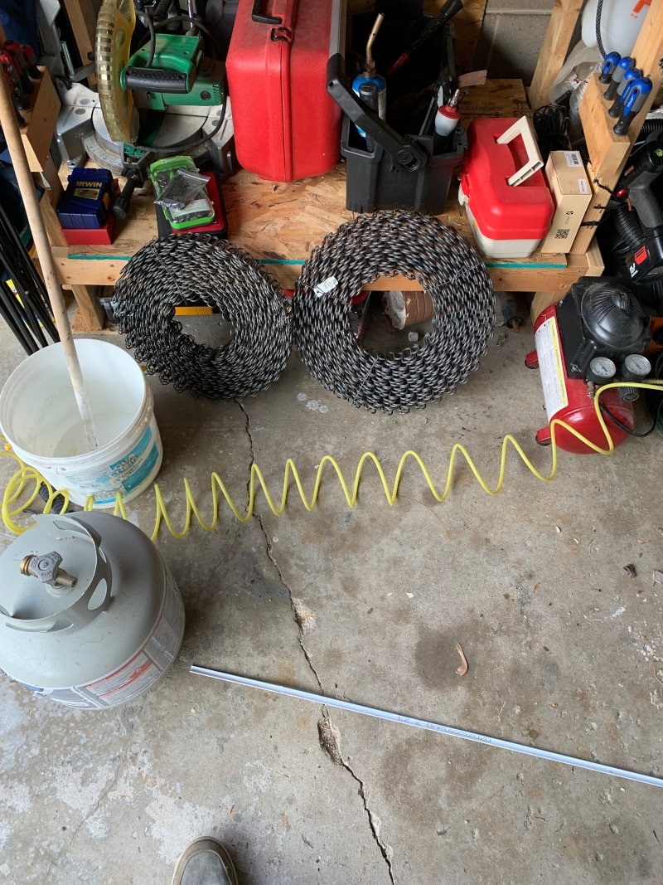

## The build

I began building it sometime around the end of June, and I was heading back to
school in early August. That left me about a month to complete the entire couch
after work every day. (which turned out to be a few hours a day when I had
daylight)

### Crossmembers

I began with the cross-members. I used 2x6s with strip of 1x2 screwed onto one side.
This 1x2 would serve as a ledge for the support sections to sit on top of. I notched
out the ends of each of the boards so that when the frame was assembled, the pieces
would fit together without a simple butt joint. I was careful to make the top notch
on the boards that would span the width of the couch because that way the weight of
the people would push down into the floor supports at either end.

I also drilled holes in the boards at the notches and inserted bolts that I would
use as anchor points to connect the side and front/back pieces to each other. These
bolts are not structural (in theory) and served only to hold the sections together,
so setting a bolt into the hole with construction adhesive would be plenty strong. I
simply placed 2 nuts at the end of the threaded rod and tightened them together (a
jam-nut) and then hammered the rod into the hole I had bored. The nuts helped to
prevent the bolt from just spinning in the hole when I tightened a nut on the other
end, because their hexagonal edges dig into the wood.

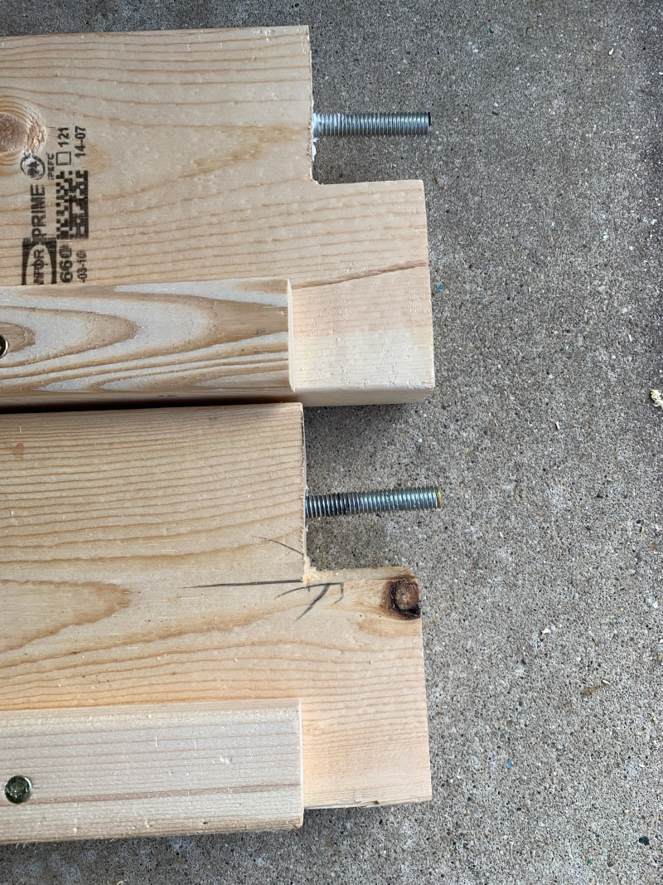

In total, there are 8 cross-members - 2 long for the bottom, 2 long for the top, and
2 short for each of the sides on the bottom and the top. Each was constructed the
same way.

### Floor Supports

The next things to construct were the floor supports. This was perhaps the most
complicated part of the woodworking in the project.

I had a few goals in mind. I didn't want arms on the couch - they would not only
be difficult to construct, they would limit how many people could sit (by
removing the ends of the couch) and make it uncomfortable to lay on. (for me -
I'm relatively tall)

I settled on a design that would support both the back supports and the bottom
supports without any hardware, provide an adequate angle for the back support,
and that would not look terrible. It was connected with either only glue or with
pocket screws and glue, depending on how hard it would be to clamp things in
place.

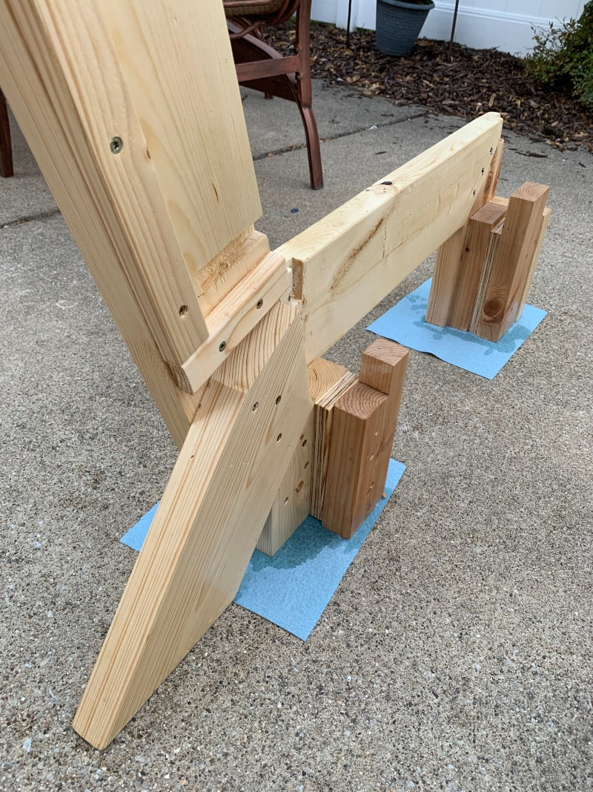

The crossmembers didn't require any hardware to fit into these floor supports
_(kind of, see below)_, so assembly and disassembly of the couch would be
simple. They fit into rails and were held together like puzzle pieces.

### Spring Boxes

The spring boxes were next. These are really the main part of the couch - they
provide support for the cushions. As mentioned earlier, I built these as modular
sections, so each cushion got a support section.

They were constructed out of 3/4" plywood which was simply butt-joined at the
corners using glue and a nail gun. The corners were reinforced using triangular
pieces of 1/2" OSB that I had laying around. I used another strip of plywood in
the center of the box along the axis that the springs were tensioned. This
helped prevent bowing in the middle of the sides of the box.

The boxes were then fitted with the springs. There were a few considerations
here when building: the springs for the back support should be looser than the
ones for the bottom support, and the springs must be connected laterally
somehow.

I used 8-gauge springs for the bottom and 10-gauge springs for the back. The
process for attaching them is pretty straightforward - lay out the spring clips
(I went with 6" apart) and then pull the springs as tight as you can get them.

There is a step missing here if you haven't noticed - cutting the springs to
length. This was a bit of a challenge for me because for some reason I couldn’t
find a good pair of bolt cutters. They would've made the job a lot easier.
Instead, I had to use an angle grinder with a cutoff wheel to cut each spring to
length. As you can imagine, cutting about 36 springs down to length gets tedious
quickly, so that'll go on the list of things I'd change at the bottom of this
post.

After the springs were in place, it was time to add lateral stability. In
commercial couches this is done by tying the springs together with a steel wire.
I didn't want to spend the money on tons of steel wire because I was only
building one couch. As such, I decided to tie my springs together with nylon
string. I tied each spring together in 5 places, and I made sure to tie them as
tight as possible. The end goal is a sort of grid structure, where one axis is
springs, and the other is string. If done properly, the springs shouldn't be
able to twist at all, and if you apply pressure in the middle each spring should
take some of the weight.

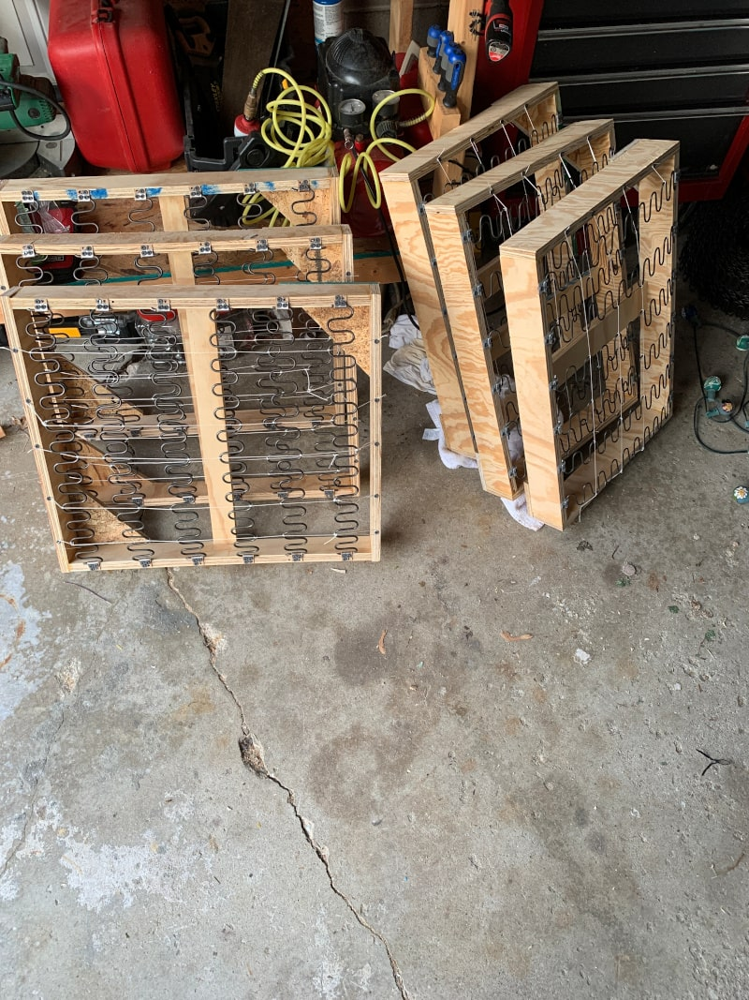

The final step on the cushion supports was to cover the springs with something.
I chose a canvas-like material for its strength. The only purpose of the
covering is to prevent the cushions from directly touching the springs of the
couch, which could lead to tears in the fabric. In my case, a little bit of
surface rust developed on the springs. Without the canvas layer, that rust
could've gotten on the cushions and stained them.

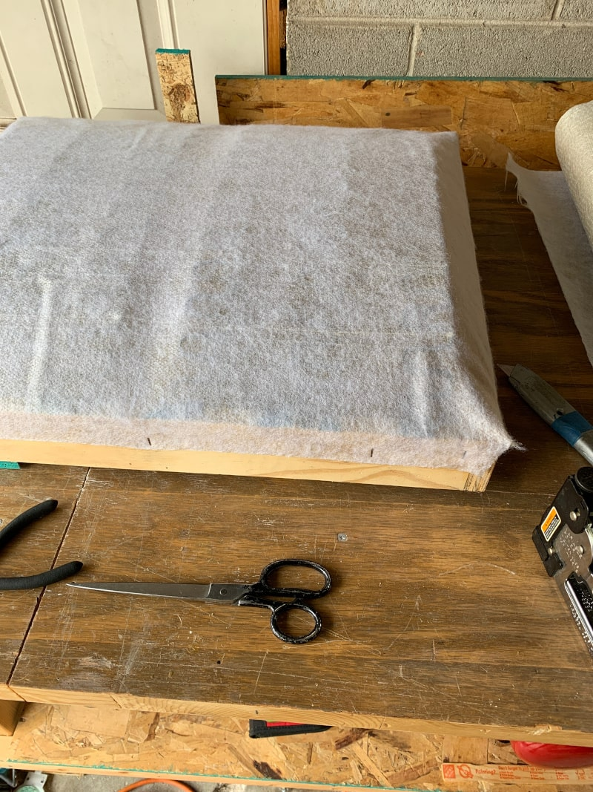

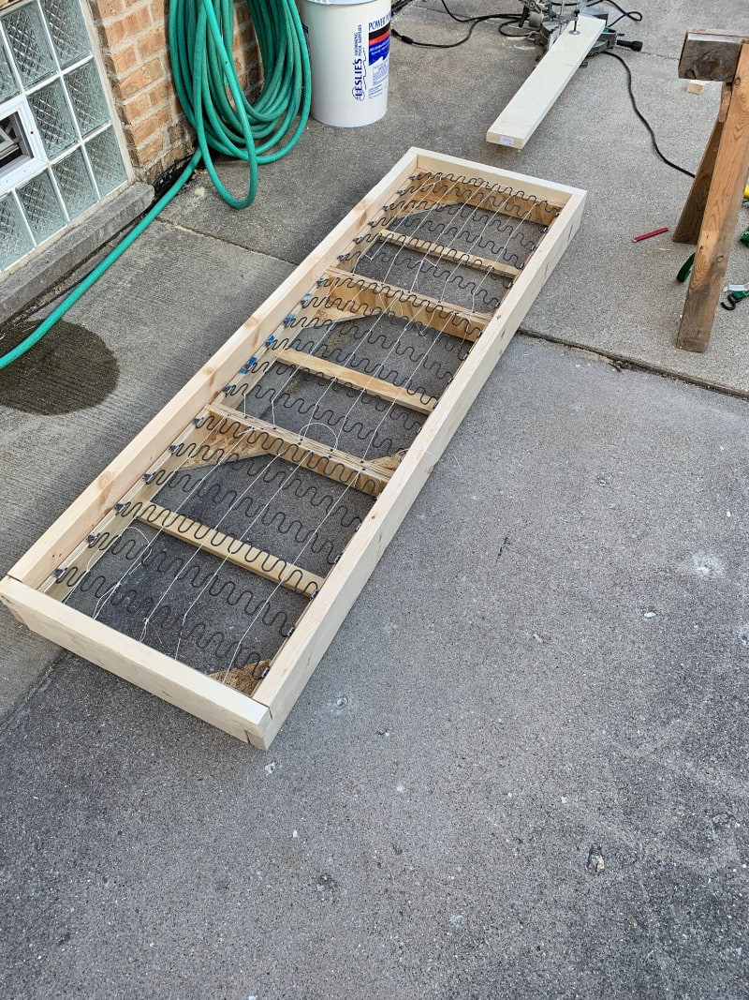

### Cushions

The cushions were the final part of the construction. I opted to make these from
scratch - despite cushions being commercially available - for a few reasons. The
first step was to cut the foam to size. It was shipped to me in long sheets
which I had to cut down into three pieces. I used a serrated bread knife to cut
the foam.

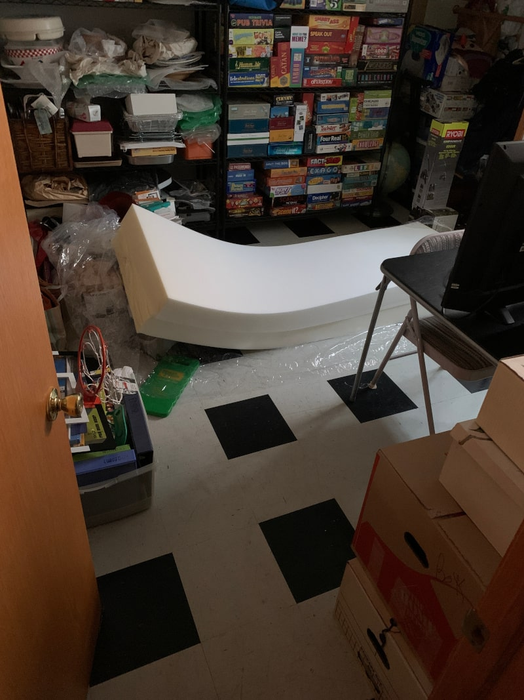
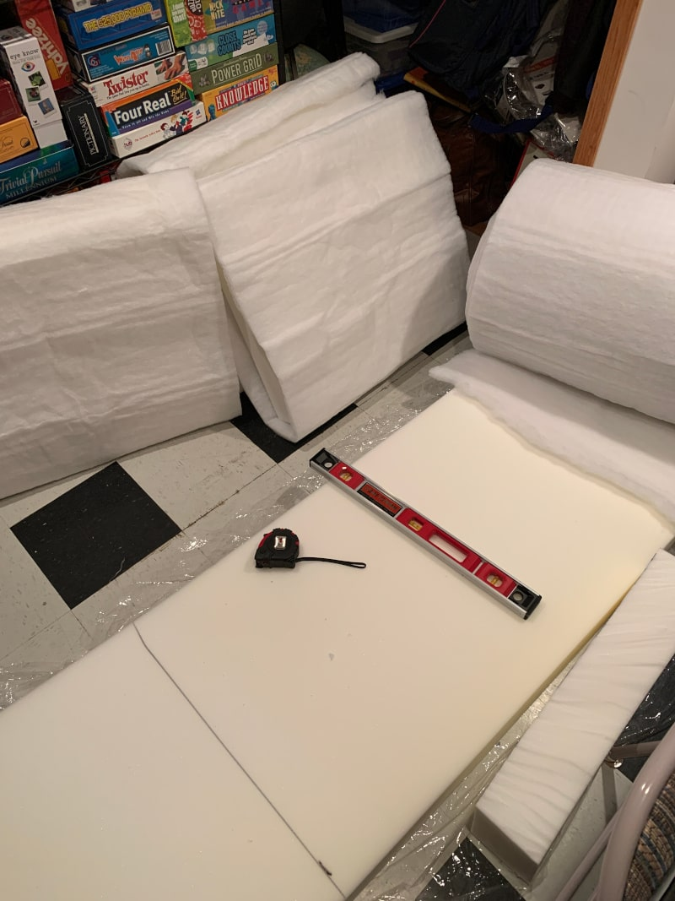

Once the cushions were cut to size, I used spray adhesive to bind another
foam-like material called fiberfill that doesn't provide support but is used to
help the cushion 'fill' the cover. Without it, the cover would be loose on the
cushion and would not only look bad - it could also allow the cover to slide
around and tear.

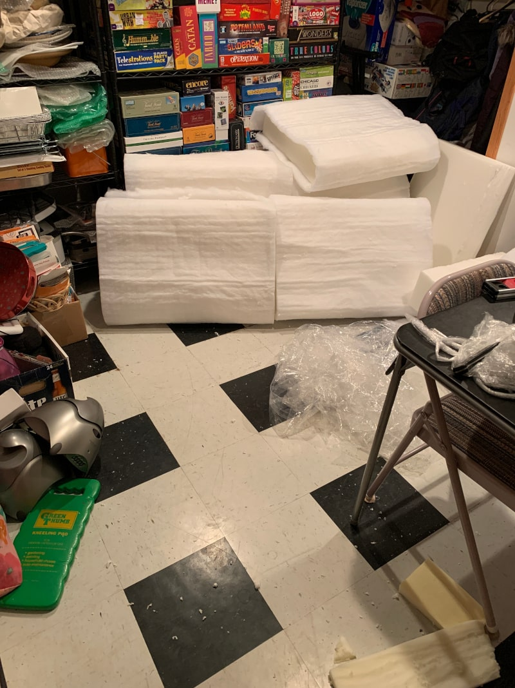

With the cushion cut and fiber-ed, it was time to make the cushion covers. I
again decided to sew these from scratch.

I bought 10 square yards of fabric and cut it down to size to sew covers for all
six of the cushions. Sewing cushion covers was perhaps the best documented of
any of the tasks that the couch required, so after a few YouTube videos, I felt
confident enough to give it a go myself.

To give a high-level overview, each cover involved cutting 9 pieces: 2 large
square pieces for the top and bottom, 3 pieces for the sides, and then the last
side is split in half to allow for a place to slide the cushion into the cover.

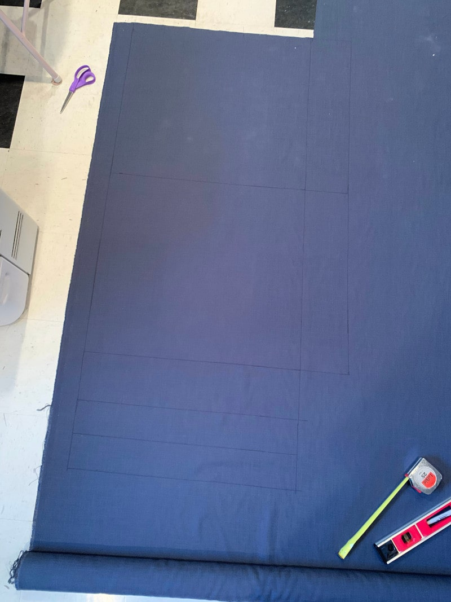

I first sewed Velcro strips onto the half-sides for the opening. After the
Velcro was in place, I sewed the 4 sides into a box. The last step was then
sewing the top and bottom to that box. After that, the cushion was complete! I
shoved the cushions into the covers and closed them up, and the couch was mostly
done.

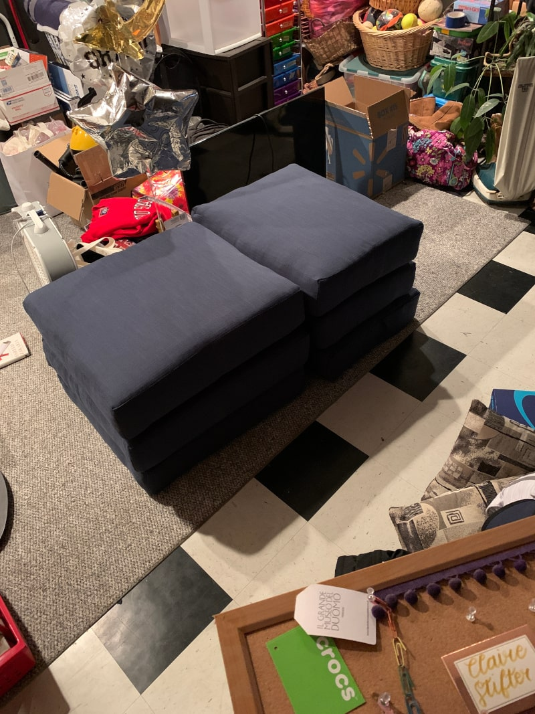

### Finishing touches

I added a thick coat of oil-based polyurethane onto any outward facing wood. I
wanted the surface to be glossy to prevent any spilled liquids soaking into the
wood.

## Conclusion

Assembling the couch after all these steps was simple. The cushion supports sit
into the frame made by the crossmembers. The frames made by the crossmembers
then sit right into the floor supports. That's it. Couch done. _kind of..._

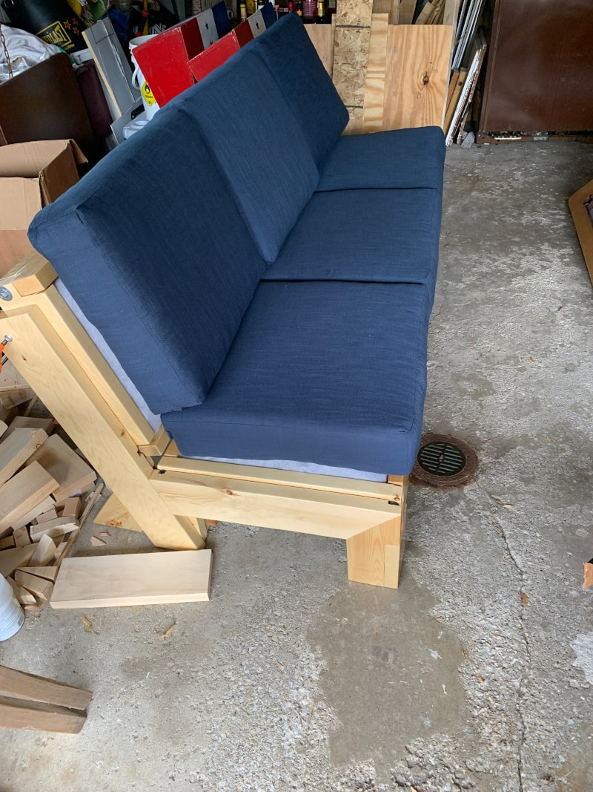

I added a cover to the cushion for reasons which will be listed below.

---

## Things I would change for next time

1. #### Don't make the spring sections modular

   - Since there is no string tying together springs at the edges of each box,
     there is a tendency to "sink" into the couch near those edges. It isn't the
     end of the world, but it bugs me.

   - In practice, it's rare that I take it apart so far as to remove the spring
     boxes. It is still very easy to move just the bottom and back frames, and
     leaving the boxes in place allowed me to screw them all into the
     crossmembers which
     _significantly_ increases stability of the entire couch. It used to feel much
     more fragile before screwing the boxes together

   - Poor tolerances on the box construction led to the bolts on the crossmembers
     eventually backing out of their holes, so I had to screw the crossmembers
     together as well. The boxes were about 1/2" too wide, and the force from
     wrenching down on the bolts eventually pushed them out of the wood.

   #### Conclusion

   Instead of creating spring boxes, I would secure the springs directly to the frame.
   The spring clips would be screwed into the 2x6" crossmembers so that they are
   vertical.

   This solves a few problems. Namely, the cushions don't sit flat on the couch
   because the springs are bowed upward. This bowing is mostly unavoidable.
   Putting the clips on the crossmembers down an inch or two from the edge would
   give the springs some room to bow out without the cushions being impacted.

   This would additionally remove the need for the cushion cover, which right now
   serves to keep the cushions from falling off the couch when people sit. The
   reason the cushions move at all is because they don't sit flat.

   Another benefit of attaching springs directly to the frame is strength. Springs
   anchored in 2x6"s will be **much** sturdier than the ones set in 3/4" plywood.

   The frame could also then be joined differently because the crossmembers
   would no longer need to come apart. This would remove the need for notches in
   the floor supports to accommodate the bolts sticking out and would make the
   entire thing much prettier.

1. #### Closed bottom

   The spring sections do not have closed bottoms. The result of this is that someone
   standing on the couch could potentially put all of their weight into one or two
   springs and rip them right out of the wood.

   The other issue a bottom would (somewhat) prevent is the sinking in. A bottom would
   force the cushion to stop sinking at a certain depth, and even though this might put
   more strain on the cushions from being compressed by a flat surface instead of
   supported by a spring, the effects would likely be negligible.

   #### Conclusion

   Put a bottom on the frame. 1/2" plywood would probably be sufficient.

### My notes about couch building techniques and alternative methods coming shortly...
